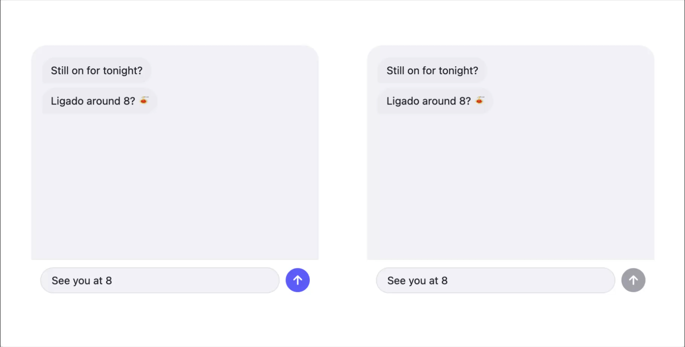
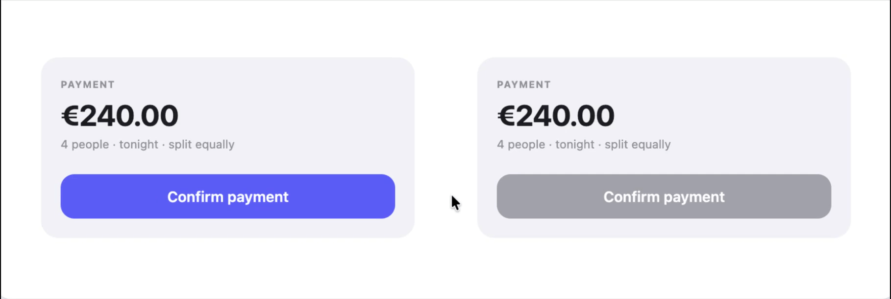
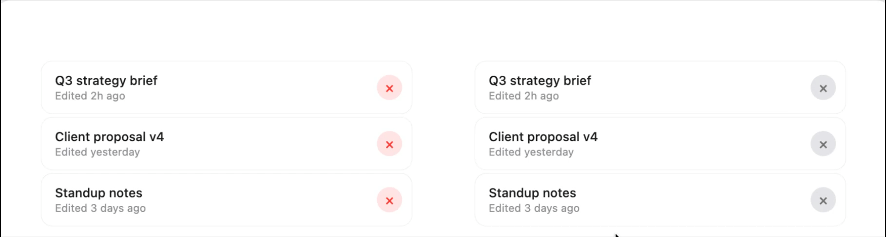
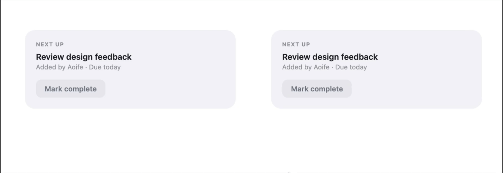

# Interfaces That Feel

A living practice for designing interaction with emotional intelligence. Every decision — timing, easing, spring resistance, haptic, copy — is made from the inside out: start with the felt state of the person, not the task.

Emotional resonance is a through-line from premise to pixel. You can fail it at either end.

---

## What's here

| File | What it does |
|---|---|
| [`qualities.html`](qualities.html) | Interactive browser for all 15 felt vocabulary terms — use this to decide which quality belongs on which micro-interaction |
| [`comparisons.html`](comparisons.html) | Four side-by-side comparisons showing each quality against the default — Witnessed, Decisive, Grounded, Punctuated |
| [`vocabulary-implementation-specs.md`](vocabulary-implementation-specs.md) | Spring params, CSS easings, durations, haptic calls, and critical failure notes for all 15 terms |
| [`vocabulary-frogger-map.md`](vocabulary-frogger-map.md) | Frogger recipe for each term: which of the 6 coupling characteristics are load-bearing |
| [`inside-out-brief-template.md`](inside-out-brief-template.md) | One-page brief to fill before any interaction design work |

---

## The Quality Browser

Open [`qualities.html`](qualities.html) in a browser. All 15 terms, live and interactive, grouped by category.

**How to use it:** When you're designing a micro-interaction and you know roughly what it should feel like but not exactly — open this page and feel your way through the category. Weight vs Resistance vs Rhythm vs Echo. Tap each demo until you find the one that matches the emotional intent.

### The 15 terms at a glance

**Weight** — how much the interaction costs
| Term | The feeling |
|---|---|
| Settled | Completes at its own pace. Overdamped, no bounce. |
| Grounded | Consequential. Compresses at commit, weighted exit. |
| Weightless | Near-zero effort. Velocity continuity mandatory. |
| Featherweight | Light, explicitly reversible. Undo structurally visible. |

**Resistance** — how much the interface pushes back
| Term | The feeling |
|---|---|
| Decisive | Snaps at action. Fires on touchDown, not touchUpInside. |
| Resistant | Gives way only at threshold. Haptic at threshold, not completion. |
| Tentative | Barely registers. Reversibility is in the physics, not the copy. |
| Yielding | Carries your momentum. Zero stiffness during gesture, velocity-seeded on release. |

**Rhythm** — the temporal shape
| Term | The feeling |
|---|---|
| Gathered | Ambient recedes, focal expands. A held breath before action. |
| Patient | Loading is preparation. 2.5s shimmer, unhurried. No urgency markers. |
| Punctuated | Attack then decay — two animations, not one. Haptic at the peak. |

**Echo** — how the system responds after
| Term | The feeling |
|---|---|
| Heard | Specific acknowledgment. "Your draft is saved" not "Saved." |
| Echoed | Stone then ripple. Secondary effect originates spatially from primary. |
| Absorbed | No feedback. The state change is the confirmation. |
| Witnessed | The action crosses a boundary. Travel animation from origin to destination. |

---

## The Comparisons

Open [`comparisons.html`](comparisons.html). Each comparison puts the felt quality side-by-side with what ships by default.









| Comparison | What it shows |
|---|---|
| Witnessed vs Default | Action traveling to a destination vs silent disappear |
| Decisive vs Default | TouchDown snap vs touchUpInside delay |
| Grounded vs Default | Compressed commit + weighted exit vs instant completion |
| Punctuated vs Default | Attack-decay two-phase vs single flat animation |

---

## The Inside-Out Brief

Before any interaction design work, fill out [`inside-out-brief-template.md`](inside-out-brief-template.md).

The sequence is mandatory — each field unlocks the next:

```
1. The Moment      — user's emotional state arriving / what they want to feel leaving
2. The Felt Quality — name it precisely from the vocabulary
3. The Frogger Recipe — which of 6 coupling characteristics are load-bearing
4. Material Implications — derive timing, dynamics, modality, expression from the recipe
5. The Default You're Replacing — what would ship if no one thought about this
6. Success Check — one observable user behavior, not a metric
```

If you can't answer field 2, you're not ready to design the interaction.

---

## The Interaction Frogger

The Frogger (Wensveen et al., DIS 2004) maps how tightly a response is coupled to the action. Six characteristics determine felt quality:

| Characteristic | The question |
|---|---|
| Time | When does the response happen relative to the action? |
| Location | Where does the response appear relative to where the action happened? |
| Direction | Does the response direction match the action direction? |
| Dynamics | Does the response weight match the action weight? |
| Modality | Does the response modality match the action modality? |
| Expression | Does the response register how the action was performed? |

**Dynamics is load-bearing for almost everything.** Most products leave all six at framework defaults. Naming which ones you're setting intentionally is the design act.

Full recipes for each of the 15 terms are in [`vocabulary-frogger-map.md`](vocabulary-frogger-map.md).

---

## The Skill

The Claude Code skill (`/interfaces-that-feel`) is auto-invoked on any product ideation or UI/UX work. It covers:

- Inside-out practice framework
- Heartbreak design briefs (4 fully developed)
- Physical world vocabulary (16 entries)
- Calibration by emotional register
- The Feel Framework (voice / earned emotion / step back)
- Product references (Figma, How We Feel, Headspace, Gentler Streak, Amie, Arc)
- Anti-patterns
- Motion, keyboard, copy checklists

---

## Recording the demos

The GIF slots above are placeholders. To capture them:

1. Open the HTML file in Chrome
2. Use [Rottenwood](https://rottenwood.com/) or [GIPHY Capture](https://giphy.com/apps/giphycapture) to record a specific element
3. Or: open Chrome DevTools → More tools → Animations panel to inspect timing
4. Drop the recorded `.gif` files into `assets/` — filenames match the `<!-- gif: -->` comments above

For screen recording on macOS: `Cmd + Shift + 5` → select area → record. Export as GIF with [Gifski](https://gif.ski/) for best quality.

---

## Research foundation

The practice is grounded in peer-reviewed HCI and design research. Full bibliography in the installed skill file at `~/.claude/skills/interfaces-that-feel/SKILL.md` under Research Backbone.

Key anchors: Norman (2004) on emotional design, Wensveen et al. (2004) on Interaction Frogger, Kuenen (2018) on inside-out design as method, Dourish (2001) on embodied cognition, Tversky et al. (2002) on when animation aids comprehension.
